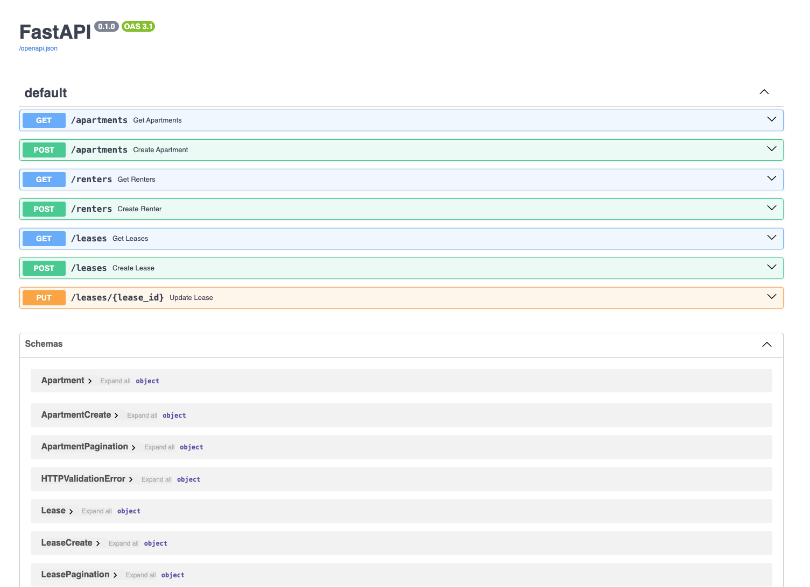
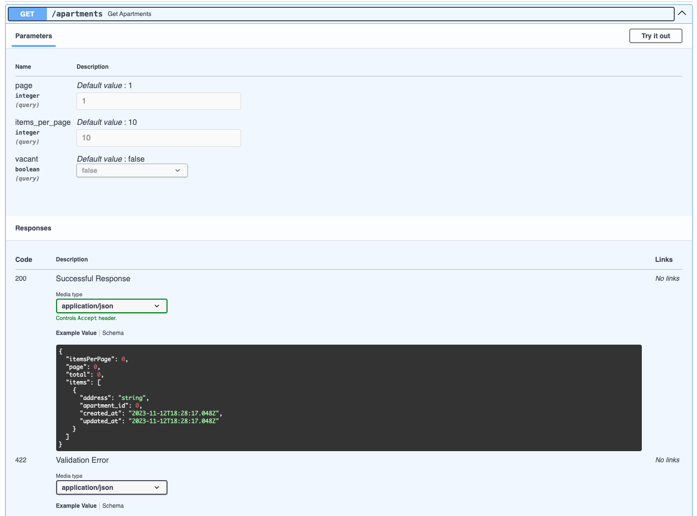

# Property Management API

This application serves as the backend for a property management system. It provides functionalities to to manage properties, specifically apartments that are rented out. The API provides endpoints to create, retrieve, and update information related to apartments, renters, and leases.

The application is built with FastAPI. Pydantic is used for data validation and SQLAlchemy for performing operations on the PostgreSQL database. Database migrations were done with Alembic. Ruff is used as linting and formatting tool.
Pagination is supported on endpoints that return lists of objects.

## Running the Application
To run the application locally, run: `docker-compose up --build`.

Once the app is up and running, the interactive API documentation can be found at http://localhost/docs.

## Running the Tests
The unit tests can simply be run by switching into the project directory and running: `pytest`.

### Notes
- Asynchronous database operations could increase performance. SQLAlchemy does [not support](https://fastapi.tiangolo.com/tutorial/sql-databases/#about-def-vs-async-def) the `await` expression. Another library such as `databases` is needed to add async support, as described [here](https://fastapi.tiangolo.com/how-to/async-sql-encode-databases/?h=async+sql#async-sql-relational-databases-with-encodedatabases). This was not implemented for this particular application.
- Further tests need to be added to achieve full test coverage.